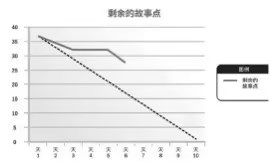

# 7.20

1、一个项目经理与项目的承包商之间发生一点问题，他不确定承包商是否遵照合同。那个知识领域中的过程最适合帮助他解决这个问题？
A、成本管理。
B、风险管理。
C、采购管理。
D、沟通管理。
`解析：控制采购管理过程管理供应商的绩效`

2、你是一个建筑项目的项目经理。你刚刚建立了一个名单，其中包括将受到这个项目直接影响的所有人员。你现在属于哪个过程组？
A、启动。
B、规划。
C、执行。
D、监控。
`解析：启动过程组中建立相关方登记册`

3、以下哪一个不是过程组？
A、监控。
B、收集需求。
C、启动。
D、收尾。
`解析：收集需求是范围管理知识领域的一个管理过程`

4、以下哪一个不是知识领域？
A、范围。
B、整合。
C、采购。
D、启动。
`解析：启动是管理过程组`

5、你刚收到一个变更请求，这说明什么？
A、项目章程是完备的，不过工作还不能开始，因为你需要对范围基准做一个变更。
B、你正处在指导和管理项目执行过程中，现在可以实现变更。
C、这个变更在实现前需要得到批准。
D、可交付成果中存在一个缺陷，必须补救。
`解析：确定性答案只有C`

6、最近开发团队对于从公司主管处收到的有关产品发布的电子邮件和电话数量表示担忧，scrum 主管应该怎么做？
A、通知开发团队忽略电话和电子邮件。
B、与产品负责人一起，重新引导主管获取信息的途径。
C、让产品负责人将这些请求做为高优先级录入产品待办事项中。
D、scrum主管将这些请求作为高级优先级录入产品待办事项中。
`解析： 排除法。是否为高优先级需求不确定，scrum主管不能确定优先级，选项C、D排除。选项A，直接忽视，可能会带来其他潜在问题，不妥。对于这些请求，可以与PO一起合作，引导解决问题。`

7、一名高管，也是上报联系人，在产品上线期间加入一个敏捷团队，在下一个 sprint 之前，该高管向团队询问接下来应应包含的特性，该高管应本应参加什么会议？ 
A、回顾会议。
B、每日 scrum 会议。
C、sprint 评审会议。
D、sprint 计划会议。
`解析：sprint计划会议，会明确当前迭代的计划，包括目标、包含的特性等。`

8、基于此燃尽图，一个敏捷项目经理应如何评估迭代的现状（见下图） ？
A、团队进展顺利，没有任何障碍。
B、团队进行范围变更以恢复正轨。
C、团队保持努力，不做任何变更。
D、团队需要协助，满足计划。

`解析：燃尽图是剩余工作与时间盒内剩余时间关系的一种图形化表示形式。如图显示，剩余的工作比计划的多，表明当前进展落后。`

作答：C  B  B D C B  C  D
答案：C `A` B D C B `D` D
